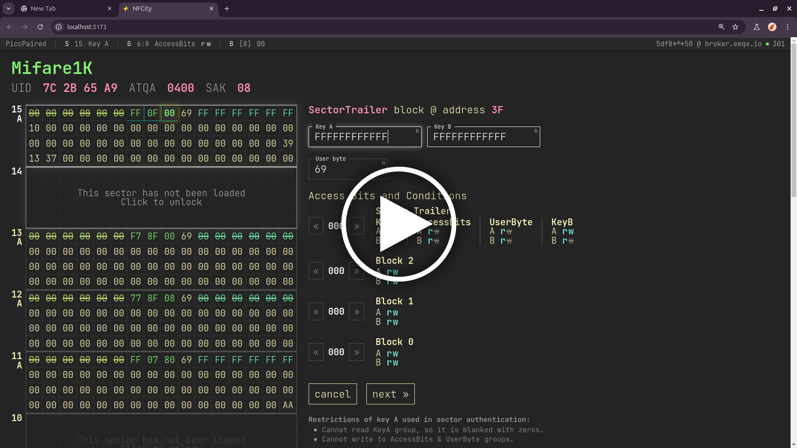
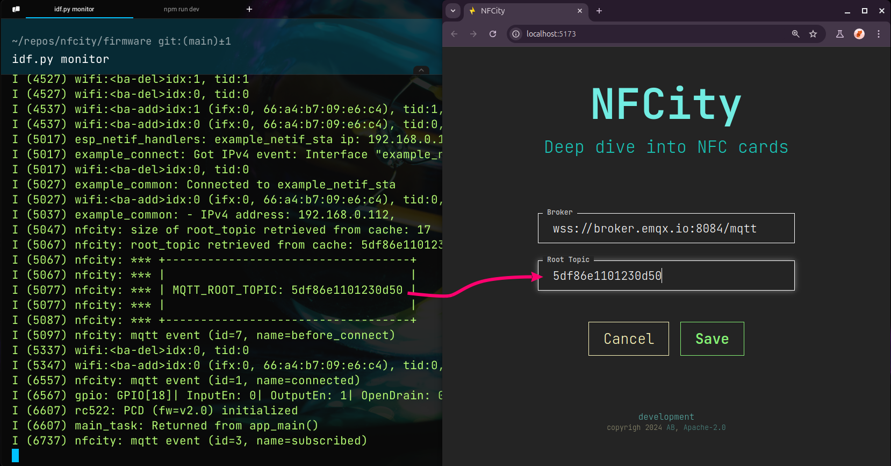

# NFCity

Project that provides a simple way to inspect and modify memory of NFC/RFID cards.

[](https://youtu.be/X7W1hfjEc5A)

Through an in-browser web application, you can unlock and modify the card's memory blocks.

Project page:
https://abobija.com/projects/nfcity-esp32-nfc-card-tool

## 1. Motivation

While developing a [library](https://github.com/abobija/esp-idf-rc522) for interacting with NFC cards using the [MFRC522](https://www.nxp.com/docs/en/data-sheet/MFRC522.pdf) reader, I gained significant knowledge about card memory structure and interaction. This knowledge came from reading datasheets and through trial and error. These resources are often technical and difficult for beginners, but they contain valuable information on how NFC cards work.

Although libraries for NFC card interaction are helpful, they usually hide the card's complexity, offering only a high-level API for reading and writing data. This project aims to provide a simple way to directly interact with NFC card memory, offering a detailed view of how the memory is structured, how to write data, and how to configure access conditions and sector keys.

## 2. Architecture

The project consists of three main components:

- Device (ESP32 with an attached RC522 reader)
- Web Application (Single Page Application)
- Messaging Bus (MQTT)

Communication between the device and the web application is handled asynchronously via the MQTT bus. The device publishes messages to the bus, while the web application subscribes to these messages. To read or write data, the web application sends a request to the device, which processes the request and responds.


The diagram above shows a typical workflow for message exchange between the web application and the device.

### 2.1. Web Application

The web application is a Single Page Application (SPA) built with Vue. It communicates with the device solely through the MQTT bus using WebSockets. The goal is to provide an easy-to-use interface for inspecting and modifying NFC cards.

If you've manually modified Mifare blocks before, you're aware of the complexity in properly building the data for the Sector Trailer block to avoid corrupting the card. This application simplifies that process by offering a user-friendly interface for modifying access bits, keys, and data blocks.

The application has a retro-hacker look and feel, with a synthwave color palette and a monospace font. Currently, it’s not fully responsive and is best viewed on desktop.

### 2.2. Device

The device is an ESP32 microcontroller with an attached [MFRC522](https://www.nxp.com/docs/en/data-sheet/MFRC522.pdf) reader. Once powered on, it connects to the local network and the MQTT bus, waiting for incoming messages from the web application. Upon receiving a message, the device processes it and sends a response back. Most messages from the web app involve operations on the NFC card, such as reading or writing data to memory sectors.

The firmware is written in C using the [ESP-IDF](https://github.com/espressif/esp-idf) framework. It leverages ESP-IDF's MQTT library for broker communication and the MFRC522 [library](https://github.com/abobija/esp-idf-rc522) for NFC card interaction.

## 3. Installation

### 3.1. Web Application

> [!TIP]
> If you want to skip building the application yourself, you can use the [hosted version](https://abobija.github.io/nfcity)

The web application is located in the [`web`](web/) directory. To build it, you'll need Node.js and npm installed. To run the application in development mode with hot-reloading, use the following commands:

```bash
cd web
npm install
npm run dev
```

Once the commands run successfully, the terminal will display the local address where the application is hosted. Open that address in your browser.

### 3.2. Device

### 3.2.1. Hardware

The device consists of an ESP32 microcontroller and an MFRC522 reader. The wiring is as follows:

| ESP32 | MFRC522 |
|-------|---------|
| 21    | MISO    |
| 23    | MOSI    |
| 19    | SCLK    |
| 22    | SDA     |
| 18    | RST     |

### 3.2.2. Firmware

The device firmware is in the [`firmware`](firmware/) directory. To build and flash the firmware to the ESP32, you must have ESP-IDF installed. Follow the instructions in the [official documentation](https://docs.espressif.com/projects/esp-idf/en/v5.3.1/esp32/get-started/index.html). 

Once ESP-IDF is installed, navigate to the `firmware` directory. Execute next command to configure the project:

```bash
idf.py menuconfig
```

In the configuration menu, set the next options:

| Option        | Path                                                  |
|---------------|-------------------------------------------------------|
| WiFi SSID     | `Example Connection Configuration` -> `WiFi SSID`     |
| WiFi Password | `Example Connection Configuration` -> `WiFi Password` |
| MQTT Broker   | `NFCity` -> `MQTT Broker`                             |


Save and exit the configuration menu. Then, build and flash the firmware:

```bash
idf.py build flash monitor
```

If the correct WiFi credentials are set, the terminal should show that the device has connected to the network and MQTT broker.

> [!IMPORTANT]
> In the terminal, a randomly generated root topic will appear. The device uses this topic for publishing messages to the MQTT broker. Use this root topic in the web application to subscribe to messages from the device. Root topics are unique to each device to avoid message collisions on public brokers. It's saved in the device's flash memory and will persist across reboots.

## 4. Usage

When you open the web application, the first step is to copy the root topic from the Device's terminal and paste it into the client configuration form. 



Save configuration and click the connect button to connect to the MQTT broker. The configuration is saved in the browser's local storage, so you don’t need to re-enter it every time.

After connecting to the broker, place an NFC card on the reader. Once detected, the card info will appear in the app, and you can start reading and writing data to the card.

## 5. Support

The project currently supports cards that are compatible with the underlying firmware [library](https://github.com/abobija/esp-idf-rc522) used for communication with the MFRC522 reader. This includes cards from the Mifare Classic family, such as Mifare 1k, 4k, and Mini.

## 6. Author

GitHub: [abobija](https://github.com/abobija)<br />
Homepage: [abobija.com](https://abobija.com)

## 7. License

This project is licensed under Apache License 2.0. See the [LICENSE](LICENSE.txt) file for more details.

## 8. Issues and Contributions

There are many features that can be added. If you have suggestions or want to contribute, feel free to open an issue or a pull request. All feedback and improvements are welcome.
